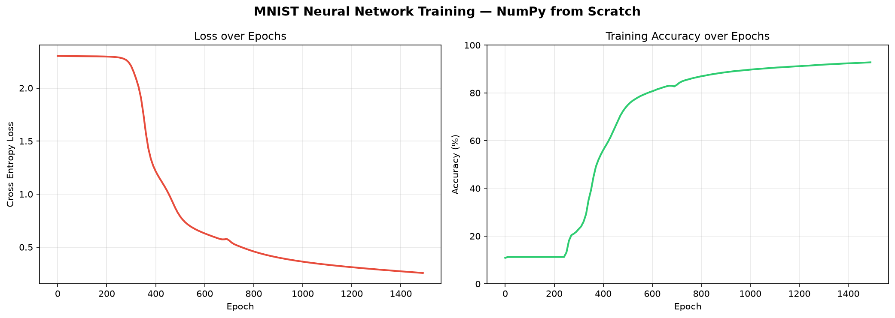
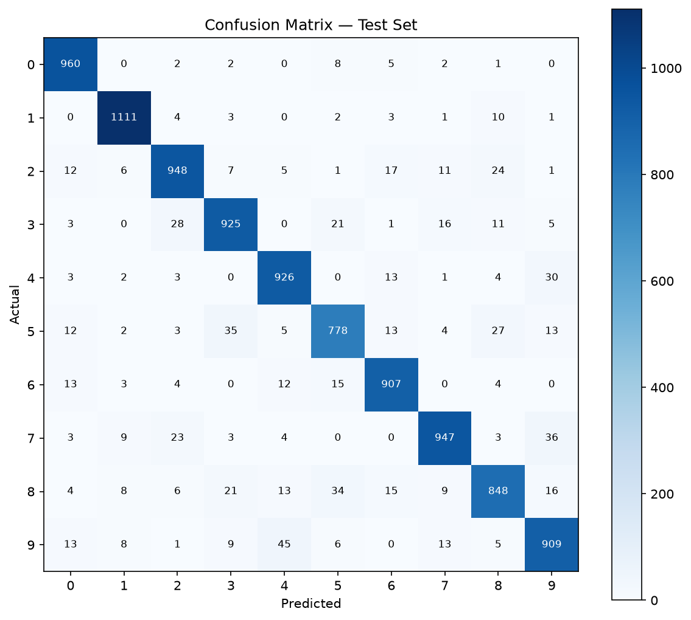

# Neural Network from Scratch — MNIST

A fully connected neural network built using only NumPy. No PyTorch, no TensorFlow, no ML libraries. Every component -> forward pass, backpropagation, gradient descent implemented manually.

**Test Accuracy: 96.57% on 10,000 MNIST test images.**

---

## Architecture

```
Input (784) → Dense (128, ReLU) → Dense (64, ReLU) → Output (10, Softmax)
```

- Input: 28x28 flattened to 784 pixels, normalized to [0, 1]
- Hidden Layer 1: 128 neurons, ReLU activation
- Hidden Layer 2: 64 neurons, ReLU activation
- Output Layer: 10 neurons (one per digit), Softmax activation
- Loss: Cross Entropy
- Optimizer: Gradient Descent

---

## Results

| Metric | Value |
|---|---|
| Test Accuracy | 96.57% |
| Training Epochs | 1500 |
| Learning Rate | 0.1 |
| Final Loss | ~0.20 |

### Training Curves



### Confusion Matrix



The model performs strongest on digit 1 (1111/1135 correct) and struggles most with digit 5 (778/892 correct). Fives frequently get confused with 3s and 8s — digits that share similar curves — which reflects a pattern even human perception finds challenging.

---

## Project Structure

```
mnist_nn/
├── data.py          # MNIST loading and preprocessing
├── nn.py            # Forward pass, activations, loss, backprop, weight update
├── train.py         # Training loop, saves params and history
├── evaluate.py      # Test set accuracy
├── plot.py          # Loss curve, accuracy curve, confusion matrix
├── assets/
│   ├── training_curves.png
│   └── confusion_matrix.png
└── README.md
```

---

## What is Implemented

**data.py**
- Downloads raw MNIST binary files
- Flattens 28x28 images to 784-dimensional vectors
- Normalizes pixel values to [0, 1]
- One-hot encodes labels

**nn.py**
- `init_params()` — Xavier-style random weight initialization
- `relu()` and `relu_derivative()` — ReLU activation and its gradient
- `softmax()` — numerically stable softmax
- `forward()` — full forward pass with caching for backprop
- `compute_loss()` — cross entropy loss
- `backward()` — full backpropagation using chain rule
- `update_params()` — gradient descent weight update

**train.py**
- Full training loop
- Logs loss and accuracy every 10 epochs
- Exports training history to CSV
- Saves trained parameters to `params.npy`

**evaluate.py**
- Loads test set
- Runs forward pass
- Reports accuracy

**plot.py**
- Loss over epochs
- Training accuracy over epochs
- Confusion matrix on test set

---

## How to Run

**1. Clone the repo**
```bash
git clone https://github.com/yourusername/mnist-nn-numpy
cd mnist-nn-numpy
```

**2. Create a virtual environment and install dependencies**
```bash
python3 -m venv venv
source venv/bin/activate
pip install numpy matplotlib
```

**3. Train**
```bash
python3 train.py
```

**4. Evaluate**
```bash
python3 evaluate.py
```

**5. Plot**
```bash
python3 plot.py
```

---

## Key Concepts

**Why build from scratch?**

Most deep learning tutorials start with PyTorch or TensorFlow. Building from scratch forces you to understand what `loss.backward()` and `optimizer.step()` actually do which is compute gradients via the chain rule and subtract them from weights. This project makes that concrete.

**Backpropagation**

The core of training. Uses the chain rule to compute how much each weight contributed to the loss, then nudges weights in the direction that reduces it. For the output layer, the gradient of softmax + cross entropy simplifies to `y_pred - y_true`.

**Numerical stability in Softmax**

Raw softmax computes `e^z / sum(e^z)`. For large values of z, `e^z` overflows to infinity. Subtracting the row maximum before exponentiating prevents this without changing the mathematical result.

---

## Dependencies

```
numpy
matplotlib
```

---

## Author

Vaibhav Patidar, B.Tech CS, JIIT Noida  
Building toward a career in Quantitative Finance and Machine Learning through deep understanding of ML fundamentals.

[LinkedIn](https://www.linkedin.com/in/vaibhav-patidar-b05235366/) | [GitHub](https://github.com/Vaibhav-Patidar)
